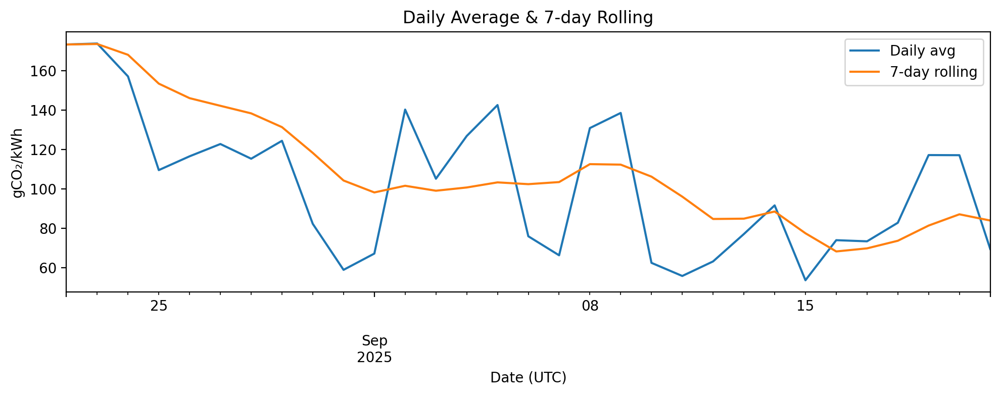
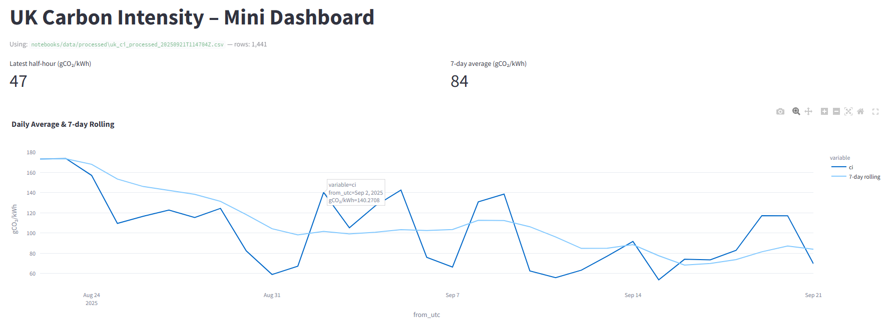

# Carbon Intensity Analysis (UK)

A compact, portfolio-friendly project that fetches **UK electricity carbon intensity** data,
cleans it, and produces simple exploratory analysis and plots.

> Carbon intensity is grams of CO₂ emitted per kWh of electricity generated.
> Source API: National Grid ESO / UK Carbon Intensity API.

## What this repo contains
- **`notebooks/01_carbon_intensity_eda.ipynb`** – Step-by-step analysis notebook.
- **`scripts/fetch_ci.py`** – Script to download data between dates and save CSV.
- **`data/`** – Raw and processed datasets (created locally when you run the code).
- **`figures/`** – Exported plots created by the notebook.

## Quickstart (Windows PowerShell)
```powershell
# 1) Clone your new GitHub repo first, or unzip this folder locally
cd carbon-intensity-analysis

# 2) Create & activate a virtual environment
python -m venv .venv
.\.venv\Scripts\activate

# 3) Install requirements
pip install -r requirements.txt

# 4) (Option A) Use the script to fetch the last 30 days
python scripts/fetch_ci.py --days 30

# 5) (Option B) Fetch a custom date range (UTC, ISO8601 yyyy-mm-dd)
python scripts/fetch_ci.py --start 2025-07-01 --end 2025-08-31

# 6) Launch Jupyter and run the notebook
jupyter notebook
# open notebooks/01_carbon_intensity_eda.ipynb in your browser
```

## Quickstart (macOS/Linux)
```bash
# 1) Clone your new GitHub repo first, or unzip this folder locally
cd carbon-intensity-analysis

# 2) Create & activate a virtual environment
python3 -m venv .venv
source .venv/bin/activate

# 3) Install requirements
pip install -r requirements.txt

# 4) (Option A) Use the script to fetch the last 30 days
python scripts/fetch_ci.py --days 30

# 5) (Option B) Fetch a custom date range (UTC, ISO8601 yyyy-mm-dd)
python scripts/fetch_ci.py --start 2025-07-01 --end 2025-08-31

# 6) Launch Jupyter and run the notebook
jupyter notebook
# open notebooks/01_carbon_intensity_eda.ipynb
```

## Data Source
- National Grid ESO / UK Carbon Intensity API. See <https://api.carbonintensity.org.uk/>
  - We use the `/intensity/{from}/{to}` endpoint (UTC timestamps).

## Typical deliverables
- Line plot of hourly and daily average carbon intensity
- Rolling 7-day average to show trend
- Hour-of-day profile averaged across period
- (Optional) Calendar heatmap of intensity by day vs hour

### Example output


## Dashboard Preview

Built with [Streamlit](https://streamlit.io/).



## Notes
- The notebook and script are robust to missing values and network hiccups.
- By default, times are handled in UTC. You can convert to Europe/London if you prefer.

---

© 2025-09-21 – MIT License (or your choice).
